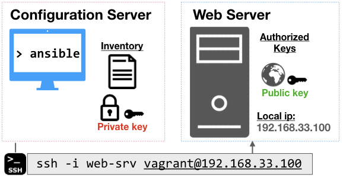
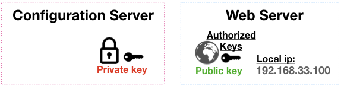

<!--
targets:
    - type: local
      name: local
    - type: bakerx
      name: config-server
    - type: bakerx
      name: web-srv      
-->

Building a Configuration Server
----------------------------------

Part 1. [Configuration Management Workshop](README.md)  
Part 2. [Building a Configuration Server](CM.md)  ⬅️   
Part 3. [Ansible Playbooks](Playbooks.md)

## Workshop

An overview of the components we will set up can be seen here:



### Checking progress on workshop

To check the configuration of the ansible server and web server, we will use `opunit` to run checks on the virtual machines listed in the inventory file. We can run checks from the top-level directory as follows.

At any time, you can run the following in on your host computer's terminal:

```bash
opunit verify -i opunit_inventory.yml
```

## Creating a connection between your servers

You need a way to automatically connect to your server without having to manually authenicate each connection. We will create a pair of public/private keys for [authentication through ssh](https://www.ssh.com/ssh/public-key-authentication#sec-Asymmetric-Cryptography-Algorithms).

From your host machine, create a new public/private key pair, running the following command:

```bash | {type: 'command'}
ssh-keygen -t rsa -b 4096 -C "web-srv" -f web-srv -N ""
```

Fill in and run a few commands to inspect the files that were created (e.g., `ls`, `head`, `cat`).

```bash| {type: 'command'}
 
```

#### How do we use these keys?

The public key (🌐), is given away. While, the private key, is hidden away (*shh* 🤫, tell no one). 

In our case, the public key will be used to _authorize_ the private key for connections to the web-server. The private key will be stored in the configuration server. It can then be used, for example, to make a ssh connection to the web-server, if needed (`ssh -i web-srv`).

<!--  -->

#### Storing the private key in the configuration server ⚒️

Use of the the below clipboard commands or simply use `cat` to see and copy the content of private key. 💡  One nice trick is to use a copy utility to copy a file into your copy/paste buffer. Mac: `pbcopy < web-srv` | Windows: `clip < web-srv` | Linux: [Check out one of these options](https://superuser.com/a/288333/862331).


```bash | {type: 'command'}
 
```

Now private key content needs to be placed inside the config-server, in a file called `~/.ssh/web-srv`. Use a terminal to create the file.

```bash | {type: 'terminal', target: 'config-server', 'background-color': '#C80815'}
```

#### Authorizing the public key on the web server 🌐

Now, we need to authorize the private key for use on the web server!

Edit the file `~/.ssh/authorized_keys`, and add the public key to the list of authorized keys. 💥  Warning! Do not delete other entries, otherwise you might make your VM in accessible from ssh.

```bash | {type: 'terminal', target: 'web-srv', 'background-color': '#003670'}
```

#### Testing your connection/Errors

Inside the config-srv, test your connection between the servers:

```bash
ssh -i ~/.ssh/web-srv -o UserKnownHostsFile=/dev/null -o StrictHostKeyChecking=no vagrant@192.168.33.100
```

```bash | {type: 'terminal', target: 'config-server', 'background-color': '#C80815' }
```

💥 You will likely see something like this!

```
@@@@@@@@@@@@@@@@@@@@@@@@@@@@@@@@@@@@@@@@@@@@@@@@@@@@@@@@@@@
@         WARNING: UNPROTECTED PRIVATE KEY FILE!          @
@@@@@@@@@@@@@@@@@@@@@@@@@@@@@@@@@@@@@@@@@@@@@@@@@@@@@@@@@@@
Permissions 0664 for '/home/vagrant/.ssh/web-srv' are too open.
```

If you see this warning, run `chmod 600 ~/.ssh/web-srv` on our private key file, in order to reduce who can read or access this file. Run the above ssh command again, it should be working! 🥳

If you *still* see an error or prompt for a password, you most likely have a problem with your key setup. Here are some steps to check:

* Double check have pasted in the content in correctly (e.g., where you in insert mode in vim before pasting?). 
* Make sure you did not mix up your private/public key.
* Make sure you *did not* change the permission of authorized_key file, which would interfere with ssh's ability to read it!
* Try running opunit, to see if you fail any unexpected checks:

```bash| {type: 'command'}
opunit verify -i opunit_inventory.yml
```

## Performing commands over ssh

Once you have established a ssh connection between two servers, you have achieved an important milestone in configuration management. 

🗿 You can now perform ad-hoc commands and even execute scripts on machines without having to manually log-in.

```bash | {type: 'terminal', target: 'config-server', 'background-color': '#C80815'}
```

For example, when you run this command.

    ssh -i ~/.ssh/web-srv -o StrictHostKeyChecking=no -o UserKnownHostsFile=/dev/null vagrant@192.168.33.100 ls /

You can see the directory of the web-srv.

Practice: From your ansible-srv, create a file by executing the command below on the remote server. Verify it exists.

    touch ssh_test.txt

#### Why not just send bash commands over ssh?

While being able to run ad-hoc commands and scripts provides a useful capability, there are several constraints that make this impractical. 

Writing bash scripts can be error-prone. Most commands are not idempotent, meaning they may cause errors or unexpected behaviors if run multiple times on the same servers. Finally, configuration of servers is an inherently noisy problem, due to network issues and random service and hardware failures. This means, you often need to resume a configuration operation after experiencing partial failure.

## Ansible

Ansible is a tool for performing configuration changes on multiple machines. Ansible uses a push-based model for configuration management, performing idempotent commands over ssh, without requiring any agent running. 

The implementation is rather straightforward: _Ansible commands are translated into python snippets, and then copied over to the target machine, and executed. This requires that python is installed on the target machine_.

### Install Ansible

🎛️  Inside the `config-server`, install ansible.

```bash | {type: 'command', target: 'config-server', stream: true, failed_when: "exitCode != 0"}
sudo add-apt-repository ppa:ansible/ansible
sudo apt-get update
sudo apt-get install ansible -y
```

Now, we can use this server to send or "push" commands to other external servers, such as web-srv.

### Creating an Inventory

An inventory file allows ansible to define, group, and coordinate configuration management of multiple machines. At the most basic level, it basically lists the names of an asset and details about how to connect to it.

Inside the config-srv, edit the `inventory` file to include the ip address, user, and path to the private key:

```ini | {type: 'file', target: 'config-server', path: '/home/vagrant/inventory'}
[web]
192.168.33.100 ansible_ssh_user=vagrant ansible_ssh_private_key_file=~/.ssh/web-srv 
[web:vars]
ansible_ssh_common_args='-o StrictHostKeyChecking=no'
```

Now, run the ping test to verify ansible is able to talk to the web-srv!

```bash | {type: 'command', target: 'config-server'}
ansible all -m ping -i inventory
```

We should see a successful connection!

```json
192.168.33.100 | SUCCESS => {
    "changed": false,
    "ping": "pong"
}
```

### Ansible commands

We can test our ability to use ansible for a simple configuration management task.

#### Installing nginx

Let's install a web server, called nginx (say like engine-X), on the web-srv VM. The web server will automatically start as a service. 

Complete the ansible command by retyping it out and looking at each parameter: `ansible all -b -m apt -i inventory -a 'pkg=nginx state=present update_cache=true'`.

```bash | {type: 'command', target: 'config-server'}
ansible 
```

Open a browser and enter in your node's ip address, e.g. http://192.168.33.100

#### Completing workshop checks

You should be able to verify all checks pass:

```bash | {type: 'command'}
opunit verify -i opunit_inventory.yml
```

#### Reflection

Great work! Running ansible commands can be useful for exploration and debugging. However, we want to be able to organize these commands into reusable configuration scripts.

[In Part 3](Playbooks.md), we will learn about creating and running ansible playbooks.

#### Extra fun

Can you provision a remote VM (from digitalocean/etc.) and then add its details to the inventory? Can you run your nginx command on it too?

## Common errors
Note, on older versions of ansible, you may fail to ping an item in your inventory if the server does not have python2. One workaround is to specify the python version explicitly. In newer versions of ansible, this will automatically be discovered by ansible. 

You can adjust the connection to account for this. Inside the inventory, add a new variable for all entries in `web` group:

```ini
[web:vars]
ansible_python_interpreter=/usr/bin/python3
```
